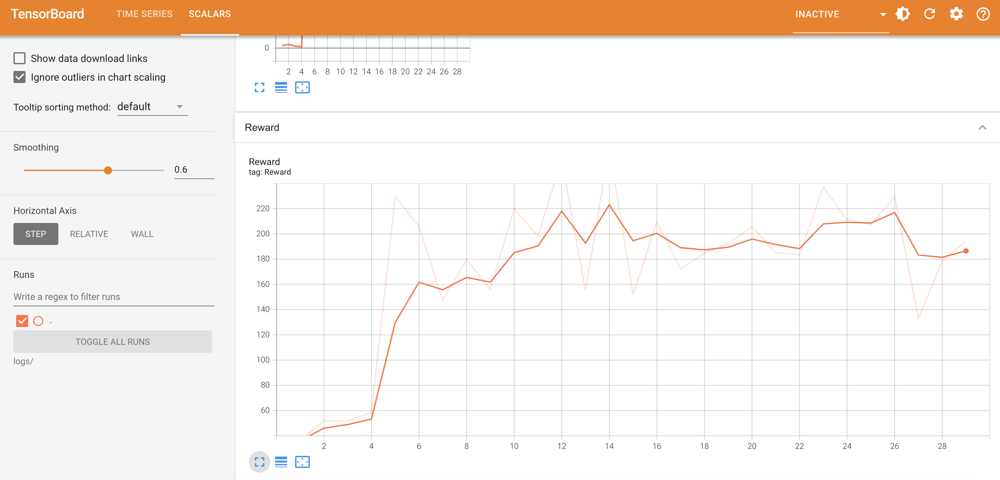

# Hotel Dynamic Pricing Game with PPO Agent

This repository contains the implementation of a custom reinforcement learning environment and a PPO (Proximal Policy Optimization) agent to solve the environment. The environment is modeled as a hotel pricing game, where the agent needs to set prices for different hotel rooms to maximize total hotel revenue over a series of interactions with customers.

## Result
The PPO agent's performance improves over time, as indicated by the increasing trend in the moving average of rewards. This suggests that the agent effectively learns to set optimal prices for the hotel rooms, balancing the trade-off between room occupancy and revenue maximization.



## High-Level Overview

### Environment

The custom environment `HotelPricingGameEnv` is designed to simulate a hotel pricing scenario where:
- The environment contains multiple hotel rooms, each with price, and affinity vector.
- Customers have individual preferences as affinity vector and willingness to pay for hotel rooms.
- The goal of the environment is to maximize total hotel revenue by setting optimal prices for different hotel rooms, considering both customer preferences and willingness to pay.

### Theoretical Concepts

1. **Reinforcement Learning**: The environment and agent interaction follows the principles of reinforcement learning (RL), where the agent learns to make decisions by receiving rewards or penalties based on its actions.
  
2. **Proximal Policy Optimization (PPO)**: PPO is a policy gradient method for RL that provides a balanced approach between performance and computational complexity. It uses a clipped objective function to ensure the policy updates are not too drastic, thus maintaining stable learning.


3. **Action Space and Observation Space**:
   - **Action Space**: The actions represent the pricing decisions for hotel rooms, whether to increase or decrease the price.
   - **Observation Space**: The observations include the current state of the hotel rooms, such as their prices, affinities, and how long they have been vacant.


4. **Reward Function**
    - **Revenue Calculation**:
        - For each customer, the function calculates the probability of booking a room based on the cosine similarity between the customer's affinity vector and the room's affinity vector, as well as the customer's willingness to pay compared to the room's price.
        - If a customer decides to book a room, the revenue is increased by the room's price, and the room is marked as booked.
    - **Vacant Room Penalty**:
        - For each room that remains unbooked, a penalty is applied based on how long the room has been vacant. The penalty is calculated as `100 x log(time_vacant)`.
        - The longer a room remains vacant, the higher the penalty.
    - **Reward Calculation**:
        - The total reward for each step is the revenue generated from the entire portfolio of booked rooms minus the vacant room penalties.

### Key Components

- **Customer and Room Initialization**: Customers and rooms are initialized with random affinities and willingness to pay or pricing, respectively.
  
- **Revenue and Penalty Calculation**: Revenue is calculated based on the rooms booked by customers, while a penalty is applied for rooms that remain vacant for longer periods.

- **State Representation**: The state is represented by the attributes of the hotel rooms, including their affinity vectors, logarithm of prices, and vacancy time.

- **Agent Training**: The PPO agent is trained through multiple episodes, where it learns to adjust the prices based on the observed states to maximize cumulative rewards.


## Running

### Setting Up Dependencies
```
pip install -r requirements.txt
```

  
### Running the Code

To run the training process, simply execute the script. The agent will interact with the environment, adjusting the prices of hotel rooms and learning to maximize revenue through reinforcement learning.

```bash
python src/game5.py
```

This project demonstrates the application of reinforcement learning to a practical problem in hotel pricing, showcasing the potential of RL in optimizing complex decision-making processes.

### Visualize Learning Results with TensorBoard

The learning script will write logs to `logs/` directory. We can use TensorBoard to visualize the learning results from the logs by running the command below.

```bash
tensorboard --logdir=logs/
```

This will start the TensorBoard HTTP server. We can access the dashboard in this URL

```bash
http://localhost:6006/#scalars
```


## Further Improvement

### Enhance the environment to better reflect real-world dynamics:
- Model customer demand based on seasonality, day of week, special events, etc. Demand will fluctuate over time. 
- Incorporate competitor pricing information. The environment should consider prices of other hotels in the same market. 
- Add in variable costs per room night sold (housekeeping, utilities, etc). Revenue maximization alone is not the goal, profit maximization is. 
- Have cancellations, no-shows, overbooking. In the real-world, not every booking results in a stay. 
### Make the action space more granular and realistic:
- Allow for setting different prices by room type, length of stay, booking channel, etc. Hotels utilize very granular pricing. 
- Enable closing out room types or lengths of stay to optimize remaining inventory. This is common revenue management practice. 
### Improve the reward signal:
- Optimize for long-term revenue or profit instead of immediate reward. Use the right success metric. 
- Consider impact of pricing on customer perception/lifetime value, not just single stay. Factor this into the reward. 
### Leverage state-of-the-art RL algorithms:
- Implement transformer-based architectures which have shown promise for RL in recent research. 
- Use more sample efficient off-policy algorithms like Soft Actor Critic (SAC). This is important in real-world settings with limited data. 
- Explore hierarchical reinforcement learning to handle multiple time scales (daily pricing vs long-term strategy). 
### Combine RL with other machine learning techniques:
- Use supervised learning to predict demand, cancellations, no-shows and feed this into the RL model. 
Leverage transfer learning to reduce learning time if expanding to new hotels.