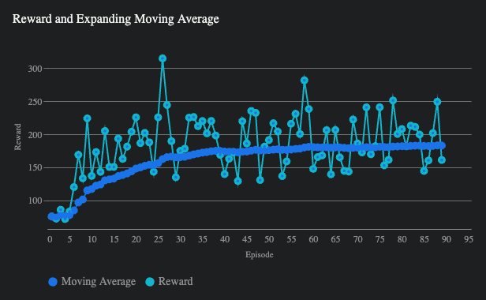

# Hotel Dynamic Pricing Game with PPO Agent

This repository contains the implementation of a custom reinforcement learning environment and a PPO (Proximal Policy Optimization) agent to solve the environment. The environment is modeled as a hotel pricing game, where the agent needs to set prices for different hotel rooms to maximize total hotel revenue over a series of interactions with customers.

## Result
The PPO agent's performance improves over time, as indicated by the increasing trend in the moving average of rewards. This suggests that the agent effectively learns to set optimal prices for the hotel rooms, balancing the trade-off between room occupancy and revenue maximization.



## High-Level Overview

### Environment

The custom environment `HotelPricingGameEnv` is designed to simulate a hotel pricing scenario where:
- The environment contains multiple hotel rooms, each with price, and affinity vector.
- Customers have individual preferences as affinity vector and willingness to pay for hotel rooms.
- The goal of the environment is to maximize total hotel revenue by setting optimal prices for different hotel rooms, considering both customer preferences and willingness to pay.

### Theoretical Concepts

1. **Reinforcement Learning**: The environment and agent interaction follows the principles of reinforcement learning (RL), where the agent learns to make decisions by receiving rewards or penalties based on its actions.
  
2. **Proximal Policy Optimization (PPO)**: PPO is a policy gradient method for RL that provides a balanced approach between performance and computational complexity. It uses a clipped objective function to ensure the policy updates are not too drastic, thus maintaining stable learning.

3. **Affinity and Willingness to Pay**: Customers and hotel rooms have an affinity vector, representing their features and preferences. The willingness to pay is a measure of how much a customer is ready to spend on a room, which influences the decision-making process.

4. **Cosine Similarity**: This is used to measure the similarity between customer and hotel room affinities. Higher similarity scores indicate a better match, increasing the likelihood of a customer choosing that room.

5. **Action Space and Observation Space**:
   - **Action Space**: The actions represent the pricing decisions for hotel rooms, whether to increase or decrease the price.
   - **Observation Space**: The observations include the current state of the hotel rooms, such as their prices, affinities, and how long they have been vacant.

### Key Components

- **Customer and Room Initialization**: Customers and rooms are initialized with random affinities and willingness to pay or pricing, respectively.
  
- **Revenue and Penalty Calculation**: Revenue is calculated based on the rooms booked by customers, while a penalty is applied for rooms that remain vacant for longer periods.

- **State Representation**: The state is represented by the attributes of the hotel rooms, including their affinity vectors, logarithm of prices, and vacancy time.

- **Agent Training**: The PPO agent is trained through multiple episodes, where it learns to adjust the prices based on the observed states to maximize cumulative rewards.


### Setting Up Dependencies
```
pip install -r requirements.txt
```

  
### Running the Code

To run the training process, simply execute the script. The agent will interact with the environment, adjusting the prices of hotel rooms and learning to maximize revenue through reinforcement learning.

```bash
python game5.py
```

This project demonstrates the application of reinforcement learning to a practical problem in hotel pricing, showcasing the potential of RL in optimizing complex decision-making processes.